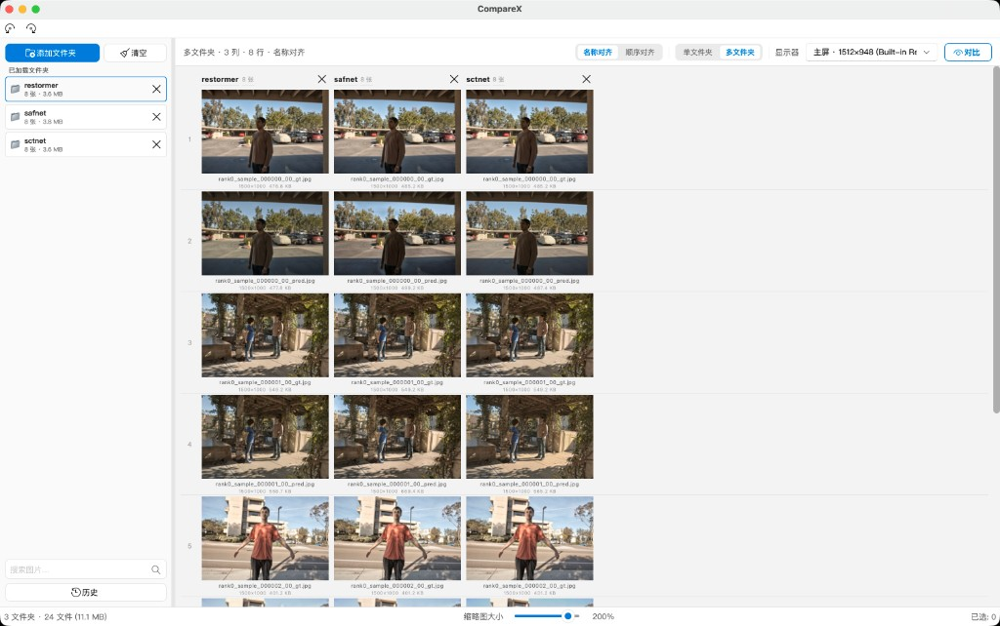

<div align="center">
  

  <h1>🔍 CompareX</h1>

  <p><b>一款轻量、高效的本地多文件夹图像对比与指标分析工具，专为计算机视觉科研工作流打造。</b></p>

  <p>
    <a href="README_EN.md">English</a> ·
    
    
    
  </p>
</div>

<br>



## 💡 为什么需要它？

做视觉实验时，真正费时间的往往不是打开图片，而是反复确认这些细节：

- 🧐 同一个样本在多个结果文件夹里是否**严格对齐**？
- 🎯 某个模型是否只在局部区域（如边缘、暗部）表现更好？
- 🎨 亮度、色偏、纹理、伪影到底差在哪里？
- 📊 PSNR / SSIM 指标高低，是否和肉眼观感一致？
- 📝 写论文或做 ablation 前，哪几组图最值得拿出来展示？

通用看图软件能浏览图片，但很少把这些动作做成一个顺手的科研工作流。**CompareX** 就是为这个场景做的：轻量、离线、本地处理，偏向“快速检查实验结果”，不是图库管理器，也不是大型标注平台。


---

## 👥 适合谁？

- 🔬 做 HDR、低光增强、去噪、超分、去模糊、重建、渲染、分割可视化等任务的研究人员
- 📁 需要同时查看 `input / gt / method A / method B / method C` 的同学
- 🖼️ 需要在论文图、补充材料、实验记录前快速筛图的人
- 🔒 想要一个纯本地工具，而不是把敏感实验图片上传到网页服务的人

---

## ✨ 核心功能

### 🗂️ 多文件夹对齐浏览
- **无缝加载**：支持拖入或选择多个文件夹，最多支持并排 12 列。
- **灵活对齐**：多文件夹下可按**文件名对齐**或按**顺序对齐**。
- **历史工作区**：自动保存工作区状态，支持恢复历史记录，适合连续几天看同一批实验。

### 🔍 沉浸式对比窗口
- **同步缩放**：多列并排显示，鼠标滚轮、触控板捏合缩放和平移完全同步。
- **快捷导航**：`Space` 下一行，`B` 上一行，长按 `Tab` 临时预览下一列。
- **信息浮层**：清晰显示文件夹、文件名、分辨率、文件大小、缩放比例等元数据。

### 🔬 像素级细节检查
- **取色吸管**：鼠标位置同步取样，精准比较多列 RGB / HEX 值。
- **像素网格**：高倍缩放后自动显示像素网格和 RGB 标注。
- **裁剪导出**：`Shift + 拖拽` 选择矩形 / 正方形 / 圆形区域并批量导出局部对比图。
- **直方图**：一键查看多图 RGB 分布差异。

### 📈 差异与量化指标
- **差异图 (Diff Map)**：支持欧式距离、L1、MSE、绝对差、通道最大差可视化。
- **色彩空间**：支持 RGB / BGR / RBG / GRB / GBR / BRG 通道顺序切换。
- **实时调色**：亮度 / 对比度 / Gamma 调节（仅影响显示，不写回原图）。
- **指标计算**：选择基准列，实时计算并标注 **PSNR / SSIM**，支持导出宽表 CSV。

### 🛠️ 扩展工具面板
- **Python 脚本**：内置自定义 Python 工具面板，适合放一些临时检查脚本（如边缘检测、mask 可视化）。

---

## 🚀 快速开始

```bash
# 克隆或下载代码后进入目录
cd CompareX

# 安装依赖
pip install -r requirements.txt

# 启动应用
python main.py
```

> **注**：配置与缓存目录默认位于 `~/.imagecompare_fluent/`

---

## ⌨️ 常用快捷键

| 快捷键 | 作用 |
|:---|:---|
| <kbd>Ctrl/⌘</kbd> + <kbd>O</kbd> | 打开文件夹 |
| <kbd>Ctrl/⌘</kbd> + <kbd>M</kbd> | 切换单 / 多文件夹模式 |
| <kbd>Space</kbd> | 打开对比 / 下一行 |
| <kbd>B</kbd> | 上一行 |
| <kbd>Tab</kbd> (长按) | 临时预览下一列 |
| <kbd>R</kbd> | 重置缩放和平移 |
| <kbd>Shift</kbd> + 拖拽 | 框选裁剪区域 |
| <kbd>Backspace</kbd> | 在对比页移除当前列对应文件夹 |

---

## 📦 打包 macOS DMG

> ⚠️ **注意**：不要在 conda 主环境里直接运行 PyInstaller，否则容易把 torch、transformers 等无关库打进包，导致体积庞大甚至 OpenCV 启动失败。

使用项目自带的精简打包脚本：

```bash
cd CompareX
bash scripts/build_mac.sh
```

产物将生成在 `dist/` 目录下：
- `dist/CompareX.app`
- `dist/CompareX.dmg`

*(首次打开若被 macOS 拦截，请右键 `CompareX.app`，选择“打开”)*

---

## 📌 说明

- CompareX 是自用工具，功能优先服务计算机视觉实验结果检查。
- 所有图片处理均在本地完成，无任何网络上传。
- 画布和缩略图网格为底层自绘，UI 控件层使用 [PyQt6-Fluent-Widgets](https://github.com/zhiyiYo/PyQt-Fluent-Widgets)。
